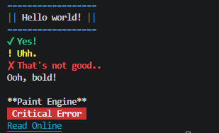

# ansify 1.0.5
 Ansify is a simple, zero-dependency Python module to print beautifully styled border text, success text, error text and warn text directly into your terminal.

---
## Features
- **Built using Pythons inbuilt capabilities**
- **Prestyled messages, just insert your text**
- **Wrap headers in clean blue borders**
- **Print out text using our brand new PAINT engine**

## Example


## Installation
To install `ansify` in locally editable mode, run the following command in the root directory:

```bash
pip install -e .